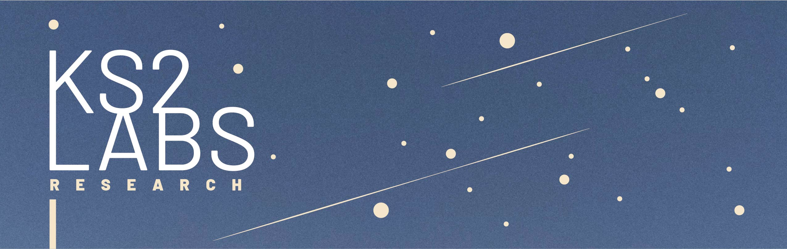

# Welcome to ks2labs Test Challenge!

In the `data/` folder you will see compressed numpy zip files, this is observed data from particle interaction simulations. Check file [`my_submission.py`](./my_submission.py) before starting. You aim is to:
1. Train three neural networks for the three datasets and submit `test_y.npz` for each dataset. In each case, create a validation split of 10% from the training set.
2. Write a trainer script / notebook for us to check your code. In case of script it should be callable from CLI like `$python train.py <something>.npz`

You get hired if a single network can perform well on all three datasets.

### Evaluation

We code in `pytorch` and prefer developers using that. You will have to mention the number of parameters of your model, for `pytorch` get code [here](https://stackoverflow.com/questions/49201236/check-the-total-number-of-parameters-in-a-pytorch-model). `test_loss` is the MSE between your submission and our golden. Scoring formula is given as follows:

```
Score = (MegaParams * TestLoss) ** -0.5

Eg #1: num_params = 151024; test_loss = 1.342  --> score = (0.151 * 1.342) ** -0.5  ~ 2.22
Eg #2: num_params = 3023432; test_loss = 0.442  --> score = (3.023 * 0.442) ** -0.5 ~ 0.865
Eg #2: num_params = 98923; test_loss = 0.902  --> score = (0.098 * 0.902) ** -0.5   ~ 3.36
```

Thus you can see that even if larger model gives the lowest test loss, it's score is the lowest. Whereas smallest model with mid-loss has the highest score.

### Code Quality

Since your code will be run only once, aim for quick and dirty implementations of code over so called "correct" (if correct means writing unittests or classes for what should be a 99 LoC). Read more [here](https://softwareengineering.stackexchange.com/questions/124835/how-do-quick-dirty-programmers-know-they-got-it-right) and [here](https://stackoverflow.com/questions/1001120/what-is-over-engineering-as-applied-to-software).

### Submission

For submitting use the file [`my_submission.py`](./my_submission.py). It will write a .npz file. Once completed mail the results and files to ks2labs@gmail.com

### FAQ

If you have any doubts raise an issue in the repo.

**Q: Do I need to perform feature engineering?**

A: No. Both input and output is raw observation values and feature engineering can cause problems in general use.
